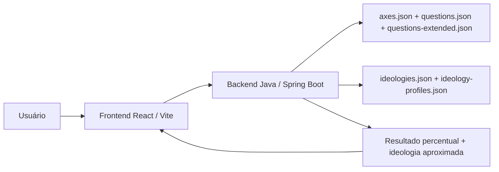

# 12 Axes

Aplicação web full stack para um quiz político baseado em 12 eixos ideológicos. O usuário escolhe entre uma versão curta com 36 perguntas e uma versão completa com 120 perguntas, recebe um resultado percentual em cada eixo, vê a ideologia política aproximada com base em uma base local de 139 possibilidades e pode baixar o resultado em PNG para compartilhar.

O projeto foi estruturado como um produto de portfólio: backend em Java com Spring Boot, frontend em React com Vite, dados versionados em JSON, sem banco de dados, e deploy configurado para Render + Vercel.

---

## Sobre o Projeto

O **12 Axes** é um quiz de orientação política inspirado em testes como 8values, 12axes e compassos políticos, mas com arquitetura própria e separação clara entre regra de negócio, dados do quiz, cálculo de pontuação e interface.

O objetivo não é rotular o usuário de forma definitiva, mas apresentar uma aproximação ideológica baseada em respostas a perguntas sobre governo, economia, cultura, religião, tecnologia, diplomacia e liberdade individual.

### Os 12 eixos avaliados

| Eixo | Polo A | Polo B |
|---|---|---|
| Estrutura | Federal | Unitário |
| Representação | Democracia | Autocracia |
| Poder | Segurança | Liberdade |
| Imigração | Assimilação | Multicultura |
| Diplomacia | Militarista | Pacifista |
| Intervenção | Não intervencionista | Nacionalista |
| Economia | Público | Privado |
| Controle | Planejamento | Livre mercado |
| Comércio | Protecionismo | Globalismo |
| Religião | Irreligioso | Religioso |
| Moral | Progressista | Tradicionalista |
| Tecnologia | Tecnologia | Biologia |

---

## Funcionalidades

### Quiz político

- Versão curta com 36 perguntas
- Versão completa com 120 perguntas
- 3 ou 10 perguntas para cada um dos 12 eixos
- Escala de resposta com 5 opções:
  - Concordo totalmente
  - Concordo
  - Neutro / Inseguro
  - Discordo
  - Discordo totalmente
- Navegação por pergunta com progresso visual
- Possibilidade de voltar e alterar respostas antes do resultado

### Cálculo de pontuação

- Cada resposta é convertida em um valor numérico entre `0.0` e `1.0`
- Cada pergunta aponta para um dos polos do eixo
- O backend calcula a média das perguntas de cada eixo conforme a versão escolhida
- O resultado final é exibido em porcentagem para os dois polos

Exemplo de regra:

| Resposta | Pontuação para o polo de concordância |
|---|---:|
| Concordo totalmente | 1.00 |
| Concordo | 0.75 |
| Neutro / Inseguro | 0.50 |
| Discordo | 0.25 |
| Discordo totalmente | 0.00 |

### Resultado ideológico

- Exibe a ideologia aproximada do usuário
- Mostra percentual de compatibilidade
- Lista outras correspondências próximas
- Mostra os 12 eixos com barras percentuais, cores próprias e cartões laterais dos polos
- Inclui descrição resumida e descrição detalhada da ideologia encontrada
- Permite baixar um PNG do resultado pelo botão `Compartilhar`

### Base de ideologias

- O backend usa uma base estruturada em `backend/src/main/resources/data/ideologies.json`
- A base tem 139 entradas no projeto
- Perfis ideológicos explícitos ficam em `ideology-profiles.json`
- As 139 ideologias têm vetor de matching explícito; se algum perfil futuro não existir, o backend cai para vetor neutro como fallback

---

## Stack Tecnológica

| Camada | Tecnologia | Papel no projeto |
|---|---|---|
| Backend | Java 21 + Spring Boot 3 | API REST, regras de pontuação e matching ideológico |
| Frontend | React 18 + TypeScript + Vite | Interface do quiz e tela de resultado |
| Dados | JSON versionado | Perguntas, eixos, ideologias e perfis de matching |
| Testes | JUnit + Spring Boot Test | Validação de pontuação, variantes e matching |
| Deploy backend | Render | Web Service via Docker |
| Deploy frontend | Vercel | Hospedagem estática do React |
| Build backend | Maven | Geração do JAR Spring Boot |
| Build frontend | npm + Vite | Build de produção |

---

## Arquitetura



### Decisões técnicas

- **Sem banco de dados:** os dados são estáticos e versionados em JSON, o que reduz custo e complexidade para o MVP.
- **Backend separado do frontend:** permite evoluir regras de pontuação sem acoplar tudo no cliente.
- **Matching no servidor:** evita expor toda a lógica de classificação como responsabilidade do frontend.
- **Docker no Render:** caminho mais previsível para hospedar Spring Boot em ambiente gratuito.
- **Vercel no frontend:** deploy simples para aplicação React estática.
- **CORS configurável por ambiente:** `FRONTEND_ORIGINS` define quais domínios podem chamar a API.

---

## Estrutura de Pastas

```txt
12Axes/
|-- backend/
|   |-- Dockerfile
|   |-- pom.xml
|   `-- src/
|       |-- main/
|       |   |-- java/com/twelveaxes/
|       |   |   |-- config/
|       |   |   |-- controller/
|       |   |   |-- model/
|       |   |   `-- service/
|       |   `-- resources/
|       |       |-- application.properties
|       |       `-- data/
|       |           |-- axes.json
|       |           |-- questions.json
|       |           |-- questions-extended.json
|       |           |-- ideologies.json
|       |           `-- ideology-profiles.json
|       `-- test/
|
|-- frontend/
|   |-- package.json
|   |-- vite.config.ts
|   |-- vercel.json
|   `-- src/
|       |-- components/
|       |-- services/
|       |-- styles/
|       |-- types/
|       |-- App.tsx
|       `-- main.tsx
|
|-- data/
|   |-- ideologias/
|   `-- img/
|
|-- docs/
|   `-- deployment.md
|
|-- render.yaml
`-- README.md
```

---

## Backend

### Responsabilidades

- Servir os dados do quiz
- Validar respostas enviadas pelo frontend
- Calcular os percentuais dos 12 eixos
- Comparar o vetor final do usuário com os perfis ideológicos
- Retornar resultado completo para a interface

### Principais classes

| Pacote | Papel |
|---|---|
| `controller` | Endpoints REST da API |
| `service` | Regras de negócio, leitura dos JSONs, pontuação e matching |
| `model` | Records e enums usados como contrato de dados |
| `config` | Configuração de CORS |

### Serviços principais

| Classe | Responsabilidade |
|---|---|
| `QuizDataService` | Carrega `axes.json`, `questions.json`, `questions-extended.json`, `ideologies.json` e `ideology-profiles.json` |
| `ScoringService` | Calcula os percentuais dos eixos com base nas respostas |
| `IdeologyMatcherService` | Encontra as ideologias mais próximas do vetor final do usuário |

---

## Frontend

### Responsabilidades

- Exibir tela inicial do quiz
- Carregar perguntas e opções da API
- Controlar progresso e respostas localmente
- Enviar respostas ao backend
- Renderizar resultado com ideologia, compatibilidade, barras dos eixos e exportação em PNG

### Componentes principais

| Componente | Papel |
|---|---|
| `QuestionCard` | Exibe a pergunta atual e as opções de resposta |
| `ProgressHeader` | Mostra progresso do quiz |
| `AxisResultBar` | Renderiza uma barra percentual por eixo |
| `IdeologyMatchCard` | Exibe ideologia, categoria, descrição e compatibilidade |

### Design e UX

- Layout responsivo para mobile e desktop
- Visual limpo com fundo claro
- Gradientes em CTAs e destaques
- Cards com bordas sutis e sombras leves
- Botões com estados de hover e seleção
- Tipografia com Poppins e Sora carregadas no `index.html`
- Barras de resultado com cartões laterais, ícones SVG e as cores definidas em `axes.json`
- Exportação de resultado em PNG com `html-to-image`, usando um nó dedicado de exportação para evitar capturar controles da interface

---

## Endpoints da API

| Método | Endpoint | Descrição |
|---|---|---|
| `GET` | `/api/health` | Verifica se a API está online |
| `GET` | `/api/quiz?variant=short` | Retorna título, descrição, eixos, perguntas e opções da versão curta |
| `GET` | `/api/quiz?variant=extended` | Retorna título, descrição, eixos, perguntas e opções da versão completa |
| `POST` | `/api/results` | Recebe respostas e retorna resultado final |
| `GET` | `/api/ideologies` | Lista as ideologias cadastradas |
| `GET` | `/api/ideologies/{id}` | Busca uma ideologia por ID |

### Exemplo de payload para resultado

```json
{
  "variant": "short",
  "answers": [
    {
      "questionId": "estrutura_01",
      "answer": "AGREE"
    },
    {
      "questionId": "estrutura_02",
      "answer": "NEUTRAL"
    }
  ]
}
```

### Exemplo resumido de resposta

```json
{
  "axes": [
    {
      "axisId": "estrutura",
      "label": "Estrutura",
      "leftPercent": 62.5,
      "rightPercent": 37.5,
      "dominantPole": "Federal",
      "intensity": "Inclinado"
    }
  ],
  "topMatch": {
    "ideologyId": "centrismo",
    "name": "Centrismo",
    "category": "Centro",
    "compatibility": 100.0
  }
}
```

---

## Como Rodar Localmente

### Pré-requisitos

- Java 21 ou superior
- Maven 3.9+
- Node.js 20+ ou superior
- npm
- Git

### 1. Clone o repositório

```bash
git clone <url-do-repositório>
cd 12Axes
```

### 2. Suba o backend

```bash
cd backend
mvn spring-boot:run
```

A API ficará disponível em:

```txt
http://localhost:8080
```

Teste rápido:

```bash
curl http://localhost:8080/api/health
```

Resposta esperada:

```json
{"status":"ok"}
```

### 3. Suba o frontend

Em outro terminal:

```bash
cd frontend
npm install
npm run dev
```

O site ficará disponível em:

```txt
http://localhost:5173
```

Por padrão, o frontend chama a API em `http://localhost:8080`.

### 4. Configurar API remota no frontend

Para apontar o frontend para o backend hospedado no Render, crie:

```txt
frontend/.env.local
```

Com:

```bash
VITE_API_URL=https://one2axes-backend.onrender.com
```

---

## Testando o Projeto

### Backend

```bash
cd backend
mvn test
```

O teste atual valida que respostas neutras produzem resultado centralizado nos 12 eixos.

### Build do backend

```bash
cd backend
mvn package -DskipTests
```

O JAR será gerado em:

```txt
backend/target/backend-0.1.0.jar
```

### Frontend

```bash
cd frontend
npm run build
```

O build de produção será gerado em:

```txt
frontend/dist/
```

### Fluxo manual recomendado

1. Acesse `http://localhost:5173`
2. Clique em `Começar Quiz`
3. Escolha entre versão curta ou completa
4. Responda as perguntas
5. Confira a ideologia aproximada
6. Verifique as barras dos 12 eixos
7. Use `Compartilhar` para baixar o resultado em PNG
8. Refaça o quiz com respostas diferentes para comparar resultados

---

## Deploy

O projeto foi pensado para deploy gratuito/semigratuito com frontend e backend separados.

URLs atuais de produção:

| Serviço | URL |
|---|---|
| Frontend | `https://12axes.vercel.app` |
| Backend | `https://one2axes-backend.onrender.com` |

### Backend no Render

Configuração recomendada:

| Campo | Valor |
|---|---|
| Service Type | Web Service |
| Runtime | Docker |
| Root Directory | `backend` |
| Instance Type | Free |
| Health Check Path | `/api/health` |

Variável de ambiente:

```bash
FRONTEND_ORIGINS=https://12axes.vercel.app
```

O backend usa:

```properties
server.port=${PORT:8080}
```

Assim o Render injeta a porta automaticamente.

### Frontend na Vercel

Configuração recomendada:

| Campo | Valor |
|---|---|
| Framework | Vite |
| Root Directory | `frontend` |
| Build Command | `npm run build` |
| Output Directory | `dist` |

Variável de ambiente:

```bash
VITE_API_URL=https://one2axes-backend.onrender.com
```

Mais detalhes estão em `docs/deployment.md`.

---

## Modelo de Dados

### `axes.json`

Define os 12 eixos, seus polos e cores.

```json
{
  "id": "moral",
  "label": "Moral",
  "leftPole": "Progressista",
  "rightPole": "Tradicionalista",
  "leftColor": "#9c27b0",
  "rightColor": "#8bc34a"
}
```

### `questions.json`

Define as 36 perguntas da versão curta, eixo relacionado e polo favorecido pela concordância.

### `questions-extended.json`

Define as 120 perguntas da versão completa, com 10 perguntas por eixo e equilíbrio entre os dois polos.

```json
{
  "id": "moral_01",
  "axisId": "moral",
  "text": "Normas sociais devem se adaptar rapidamente a novas formas de identidade, família e comportamento.",
  "agreePole": "LEFT",
  "weight": 1
}
```

### `ideologies.json`

Define nome, categoria e descrição das ideologias.

```json
{
  "id": "marxismo-leninismo",
  "name": "Marxismo-Leninismo",
  "category": "Esquerda Autoritária",
  "description": "..."
}
```

### `ideology-profiles.json`

Define vetores percentuais esperados para ideologias específicas.

```json
{
  "ideologyId": "marxismo-leninismo",
  "vector": {
    "estrutura": 22,
    "representacao": 8,
    "poder": 90,
    "economia": 95,
    "controle": 95
  }
}
```

---

## Método de Matching Ideológico

O usuário gera um vetor com 12 valores percentuais, um para cada eixo.

Exemplo:

```json
{
  "estrutura": 62.5,
  "representacao": 75.0,
  "poder": 35.0,
  "economia": 68.0
}
```

Cada ideologia também possui um vetor esperado. O backend calcula similaridade por eixo com pesos por dimensão e combina isso com uma distância ponderada entre o vetor do usuário e o vetor da ideologia.

Fórmula simplificada:

```txt
similaridadePorEixo = mediaPonderada(similaridade(usuario[eixo], ideologia[eixo]))
distanciaPonderada = rmsePonderado(usuario, ideologia)
compatibilidade = 0.65 * similaridadePorEixo + 0.35 * decaimentoPorDistancia
```

Quanto menor a distância, maior a compatibilidade.

### Observação importante

O matcher atual já usa perfis explícitos para as 139 ideologias. A precisão ainda pode ser melhorada revisando os vetores em `ideology-profiles.json`, especialmente em ideologias próximas entre si ou em perfis historicamente ambíguos.

---

## Qualidade e Validação

Validações realizadas durante o desenvolvimento:

```txt
mvn test
mvn package -DskipTests
npm run build
GET /api/health
POST /api/results com respostas neutras
GET /api/quiz?variant=short com 36 perguntas
GET /api/quiz?variant=extended com 120 perguntas
```

Resultado esperado para todas as respostas neutras:

```txt
Ideologia: Centrismo
Compatibilidade: 100%
Eixos: 50% / 50%
```

---

## Roadmap

Melhorias planejadas para evoluir o projeto:

- Refinar os vetores ideológicos em `ideology-profiles.json`
- Criar testes para o endpoint `/api/results`
- Adicionar página explicativa de metodologia
- Criar modo de revisão das respostas antes do envio
- Adicionar internacionalização PT/EN
- Melhorar acessibilidade com testes automatizados
- Adicionar pipeline CI com build de backend e frontend

---

## O que este projeto demonstra

Para avaliação técnica, o 12 Axes demonstra:

- Organização de projeto full stack
- Backend Java com Spring Boot e API REST
- Modelagem de dados sem banco usando JSON versionado
- Separação entre controller, service e model
- Regras de negócio testáveis
- Frontend React com TypeScript
- Consumo de API via camada de serviço
- Interface responsiva e orientada a fluxo
- Deploy pensado para ambientes reais
- Documentação clara para execução, manutenção e evolução

---

## Autor

**Enzo Xavier Santos**

Projeto desenvolvido para portfólio e estudo de arquitetura full stack com Java, React e deploy em cloud.
