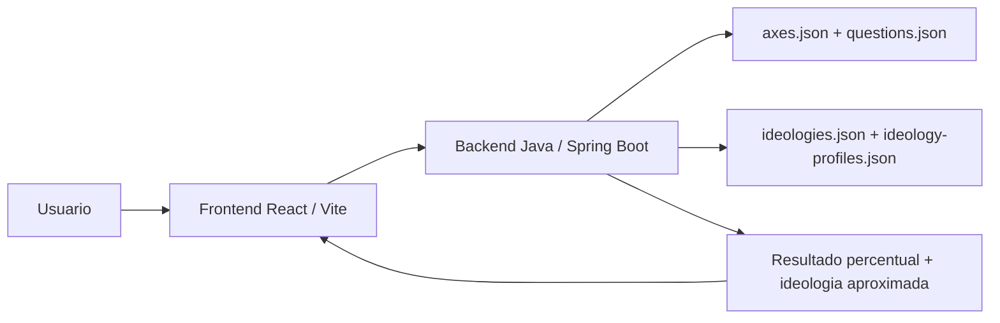

# 12 Axes

Aplicacao web full stack para um quiz politico baseado em 12 eixos ideologicos. O usuario responde 48 perguntas em escala Likert, recebe um resultado percentual em cada eixo e ve a ideologia politica aproximada com base em uma base local de 155 possibilidades.

O projeto foi estruturado como um produto de portfolio: backend em Java com Spring Boot, frontend em React com Vite, dados versionados em JSON, sem banco de dados, e deploy planejado para Render + Vercel.

---

## Sobre o Projeto

O **12 Axes** e um quiz de orientacao politica inspirado em testes como 8values, 12axes e compassos politicos, mas com arquitetura propria e separacao clara entre regra de negocio, dados do quiz, calculo de pontuacao e interface.

O objetivo nao e rotular o usuario de forma definitiva, mas apresentar uma aproximacao ideologica baseada em respostas a perguntas sobre governo, economia, cultura, religiao, tecnologia, diplomacia e liberdade individual.

### Os 12 eixos avaliados

| Eixo | Polo A | Polo B |
|---|---|---|
| Estrutura | Federal | Unitario |
| Representacao | Democracia | Autocracia |
| Poder | Seguranca | Liberdade |
| Imigracao | Assimilacionista | Multiculturalista |
| Diplomacia | Militarista | Pacifista |
| Intervencao | Nao intervencionista | Nacionalista |
| Economia | Servico publico | Servico privado |
| Controle | Planejamento economico | Livre mercado |
| Trocas / Comercio | Protecionismo | Globalismo / Livre comercio |
| Religiao | Irreligioso | Religioso |
| Moral | Progressista | Tradicionalista |
| Tecnologia | Tecnologia | Bioconservacionismo |

---

## Funcionalidades

### Quiz politico

- 48 perguntas no total
- 4 perguntas para cada um dos 12 eixos
- Escala de resposta com 5 opcoes:
  - Concordo totalmente
  - Concordo
  - Neutro / Inseguro
  - Discordo
  - Discordo totalmente
- Navegacao por pergunta com progresso visual
- Possibilidade de voltar e alterar respostas antes do resultado

### Calculo de pontuacao

- Cada resposta e convertida em um valor numerico entre `0.0` e `1.0`
- Cada pergunta aponta para um dos polos do eixo
- O backend calcula a media das 4 perguntas de cada eixo
- O resultado final e exibido em porcentagem para os dois polos

Exemplo de regra:

| Resposta | Pontuacao para o polo de concordancia |
|---|---:|
| Concordo totalmente | 1.00 |
| Concordo | 0.75 |
| Neutro / Inseguro | 0.50 |
| Discordo | 0.25 |
| Discordo totalmente | 0.00 |

### Resultado ideologico

- Exibe a ideologia aproximada do usuario
- Mostra percentual de compatibilidade
- Lista outras correspondencias proximas
- Mostra os 12 eixos com barras percentuais
- Inclui descricao resumida da ideologia encontrada

### Base de ideologias

- O arquivo original esta em `data/ideologias/ideologias_polcompball.pdf`
- O backend usa uma versao estruturada em `backend/src/main/resources/data/ideologies.json`
- A base tem 155 entradas no projeto:
  - 154 ideologias extraidas do PDF
  - 1 entrada adicionada manualmente: `Centrismo`
- Perfis ideologicos explicitos ficam em `ideology-profiles.json`
- Ideologias sem perfil manual usam heuristica por categoria e palavras-chave

---

## Stack Tecnologica

| Camada | Tecnologia | Papel no projeto |
|---|---|---|
| Backend | Java 21 + Spring Boot 3 | API REST, regras de pontuacao e matching ideologico |
| Frontend | React 18 + TypeScript + Vite | Interface do quiz e tela de resultado |
| Dados | JSON versionado | Perguntas, eixos, ideologias e perfis de matching |
| Testes | JUnit + Spring Boot Test | Validacao da regra de pontuacao |
| Deploy backend | Render | Web Service via Docker |
| Deploy frontend | Vercel | Hospedagem estatica do React |
| Build backend | Maven | Geracao do JAR Spring Boot |
| Build frontend | npm + Vite | Build de producao |

---

## Arquitetura



### Decisoes tecnicas

- **Sem banco de dados:** os dados sao estaticos e versionados em JSON, o que reduz custo e complexidade para o MVP.
- **Backend separado do frontend:** permite evoluir regras de pontuacao sem acoplar tudo no cliente.
- **Matching no servidor:** evita expor toda a logica de classificacao como responsabilidade do frontend.
- **Docker no Render:** caminho mais previsivel para hospedar Spring Boot em ambiente gratuito.
- **Vercel no frontend:** deploy simples para aplicacao React estatica.
- **CORS configuravel por ambiente:** `FRONTEND_ORIGINS` define quais dominios podem chamar a API.

---

## Estrutura de Pastas

```txt
12Axes/
|-- backend/
|   |-- Dockerfile
|   |-- pom.xml
|   `-- src/
|       |-- main/
|       |   |-- java/com/twelveaxes/
|       |   |   |-- config/
|       |   |   |-- controller/
|       |   |   |-- model/
|       |   |   `-- service/
|       |   `-- resources/
|       |       |-- application.properties
|       |       `-- data/
|       |           |-- axes.json
|       |           |-- questions.json
|       |           |-- ideologies.json
|       |           `-- ideology-profiles.json
|       `-- test/
|
|-- frontend/
|   |-- package.json
|   |-- vite.config.ts
|   |-- vercel.json
|   `-- src/
|       |-- components/
|       |-- services/
|       |-- styles/
|       |-- types/
|       |-- App.tsx
|       `-- main.tsx
|
|-- data/
|   |-- ideologias/
|   `-- img/
|
|-- docs/
|   `-- deployment.md
|
|-- render.yaml
`-- README.md
```

---

## Backend

### Responsabilidades

- Servir os dados do quiz
- Validar respostas enviadas pelo frontend
- Calcular os percentuais dos 12 eixos
- Comparar o vetor final do usuario com os perfis ideologicos
- Retornar resultado completo para a interface

### Principais classes

| Pacote | Papel |
|---|---|
| `controller` | Endpoints REST da API |
| `service` | Regras de negocio, leitura dos JSONs, pontuacao e matching |
| `model` | Records e enums usados como contrato de dados |
| `config` | Configuracao de CORS |

### Servicos principais

| Classe | Responsabilidade |
|---|---|
| `QuizDataService` | Carrega `axes.json`, `questions.json`, `ideologies.json` e `ideology-profiles.json` |
| `ScoringService` | Calcula os percentuais dos eixos com base nas respostas |
| `IdeologyMatcherService` | Encontra as ideologias mais proximas do vetor final do usuario |

---

## Frontend

### Responsabilidades

- Exibir tela inicial do quiz
- Carregar perguntas e opcoes da API
- Controlar progresso e respostas localmente
- Enviar respostas ao backend
- Renderizar resultado com ideologia, compatibilidade e barras dos eixos

### Componentes principais

| Componente | Papel |
|---|---|
| `QuestionCard` | Exibe a pergunta atual e as opcoes de resposta |
| `ProgressHeader` | Mostra progresso do quiz |
| `AxisResultBar` | Renderiza uma barra percentual por eixo |
| `IdeologyMatchCard` | Exibe ideologia, categoria, descricao e compatibilidade |

### Design e UX

- Layout responsivo para mobile e desktop
- Visual limpo com fundo claro
- Gradientes em CTAs e destaques
- Cards com bordas sutis e sombras leves
- Botoes com estados de hover e selecao
- Tipografia baseada em fontes do sistema para performance
- Barras coloridas para facilitar leitura dos resultados

---

## Endpoints da API

| Metodo | Endpoint | Descricao |
|---|---|---|
| `GET` | `/api/health` | Verifica se a API esta online |
| `GET` | `/api/quiz` | Retorna titulo, descricao, eixos, perguntas e opcoes |
| `POST` | `/api/results` | Recebe respostas e retorna resultado final |
| `GET` | `/api/ideologies` | Lista as ideologias cadastradas |
| `GET` | `/api/ideologies/{id}` | Busca uma ideologia por ID |

### Exemplo de payload para resultado

```json
{
  "answers": [
    {
      "questionId": "estrutura_01",
      "answer": "AGREE"
    },
    {
      "questionId": "estrutura_02",
      "answer": "NEUTRAL"
    }
  ]
}
```

### Exemplo resumido de resposta

```json
{
  "axes": [
    {
      "axisId": "estrutura",
      "label": "Estrutura",
      "leftPercent": 62.5,
      "rightPercent": 37.5,
      "dominantPole": "Federal",
      "intensity": "Inclinado"
    }
  ],
  "topMatch": {
    "ideologyId": "centrismo",
    "name": "Centrismo",
    "category": "Centro",
    "compatibility": 100.0
  }
}
```

---

## Como Rodar Localmente

### Pre-requisitos

- Java 21 ou superior
- Maven 3.9+
- Node.js 20+ ou superior
- npm
- Git

### 1. Clone o repositorio

```bash
git clone <url-do-repositorio>
cd 12Axes
```

### 2. Suba o backend

```bash
cd backend
mvn spring-boot:run
```

A API ficara disponivel em:

```txt
http://localhost:8080
```

Teste rapido:

```bash
curl http://localhost:8080/api/health
```

Resposta esperada:

```json
{"status":"ok"}
```

### 3. Suba o frontend

Em outro terminal:

```bash
cd frontend
npm install
npm run dev
```

O site ficara disponivel em:

```txt
http://localhost:5173
```

Por padrao, o frontend chama a API em `http://localhost:8080`.

### 4. Configurar API remota no frontend

Para apontar o frontend para o backend hospedado no Render, crie:

```txt
frontend/.env.local
```

Com:

```bash
VITE_API_URL=https://one2axes-backend.onrender.com
```

---

## Testando o Projeto

### Backend

```bash
cd backend
mvn test
```

O teste atual valida que respostas neutras produzem resultado centralizado nos 12 eixos.

### Build do backend

```bash
cd backend
mvn package -DskipTests
```

O JAR sera gerado em:

```txt
backend/target/backend-0.1.0.jar
```

### Frontend

```bash
cd frontend
npm run build
```

O build de producao sera gerado em:

```txt
frontend/dist/
```

### Fluxo manual recomendado

1. Acesse `http://localhost:5173`
2. Clique em `Comecar quiz`
3. Responda as 48 perguntas
4. Confira a ideologia aproximada
5. Verifique as barras dos 12 eixos
6. Refaca o quiz com respostas diferentes para comparar resultados

---

## Deploy

O projeto foi pensado para deploy gratuito/semi-gratuito com frontend e backend separados.

### Backend no Render

Configuracao recomendada:

| Campo | Valor |
|---|---|
| Service Type | Web Service |
| Runtime | Docker |
| Root Directory | `backend` |
| Instance Type | Free |
| Health Check Path | `/api/health` |

Variavel de ambiente:

```bash
FRONTEND_ORIGINS=https://12axes.vercel.app
```

O backend usa:

```properties
server.port=${PORT:8080}
```

Assim o Render injeta a porta automaticamente.

### Frontend na Vercel

Configuracao recomendada:

| Campo | Valor |
|---|---|
| Framework | Vite |
| Root Directory | `frontend` |
| Build Command | `npm run build` |
| Output Directory | `dist` |

Variavel de ambiente:

```bash
VITE_API_URL=https://one2axes-backend.onrender.com
```

Mais detalhes estao em `docs/deployment.md`.

---

## Modelo de Dados

### `axes.json`

Define os 12 eixos, seus polos e cores.

```json
{
  "id": "moral",
  "label": "Moral",
  "leftPole": "Progressista",
  "rightPole": "Tradicionalista",
  "leftColor": "#9c27b0",
  "rightColor": "#8bc34a"
}
```

### `questions.json`

Define perguntas, eixo relacionado e polo favorecido pela concordancia.

```json
{
  "id": "moral_01",
  "axisId": "moral",
  "text": "Normas sociais devem se adaptar rapidamente a novas formas de identidade, familia e comportamento.",
  "agreePole": "LEFT",
  "weight": 1
}
```

### `ideologies.json`

Define nome, categoria e descricao das ideologias.

```json
{
  "id": "liberalismo",
  "name": "Liberalismo",
  "category": "Centro",
  "description": "..."
}
```

### `ideology-profiles.json`

Define vetores percentuais esperados para ideologias especificas.

```json
{
  "ideologyId": "libertarianismo",
  "vector": {
    "estrutura": 68,
    "representacao": 78,
    "poder": 16,
    "economia": 18,
    "controle": 12
  }
}
```

---

## Metodo de Matching Ideologico

O usuario gera um vetor com 12 valores percentuais, um para cada eixo.

Exemplo:

```json
{
  "estrutura": 62.5,
  "representacao": 75.0,
  "poder": 35.0,
  "economia": 68.0
}
```

Cada ideologia tambem possui um vetor esperado. O backend calcula a distancia media entre o vetor do usuario e o vetor da ideologia.

Formula simplificada:

```txt
distanciaMedia = media(abs(usuario[eixo] - ideologia[eixo]))
compatibilidade = 100 - distanciaMedia
```

Quanto menor a distancia, maior a compatibilidade.

### Observacao importante

O matcher atual e um MVP funcional. Ele ja diferencia ideologias por perfis manuais e heuristicas, mas a precisao pode ser melhorada expandindo `ideology-profiles.json` com vetores revisados para mais ideologias.

---

## Qualidade e Validacao

Validacoes realizadas durante o desenvolvimento:

```txt
mvn test
mvn package -DskipTests
npm run build
GET /api/health
POST /api/results com respostas neutras
```

Resultado esperado para todas as respostas neutras:

```txt
Ideologia: Centrismo
Compatibilidade: 100%
Eixos: 50% / 50%
```

---

## Roadmap

Melhorias planejadas para evoluir o projeto:

- Refinar os 155 vetores ideologicos em `ideology-profiles.json`
- Criar testes para o endpoint `/api/results`
- Adicionar pagina explicativa de metodologia
- Adicionar compartilhamento de resultado como imagem
- Criar modo de revisao das respostas antes do envio
- Adicionar internacionalizacao PT/EN
- Melhorar acessibilidade com testes automatizados
- Adicionar pipeline CI com build de backend e frontend

---

## O que este projeto demonstra

Para avaliacao tecnica, o 12 Axes demonstra:

- Organizacao de projeto full stack
- Backend Java com Spring Boot e API REST
- Modelagem de dados sem banco usando JSON versionado
- Separacao entre controller, service e model
- Regras de negocio testaveis
- Frontend React com TypeScript
- Consumo de API via camada de servico
- Interface responsiva e orientada a fluxo
- Deploy pensado para ambientes reais
- Documentacao clara para execucao, manutencao e evolucao

---

## Autor

**Enzo Xavier Santos**

Projeto desenvolvido para portfolio e estudo de arquitetura full stack com Java, React e deploy em cloud.
